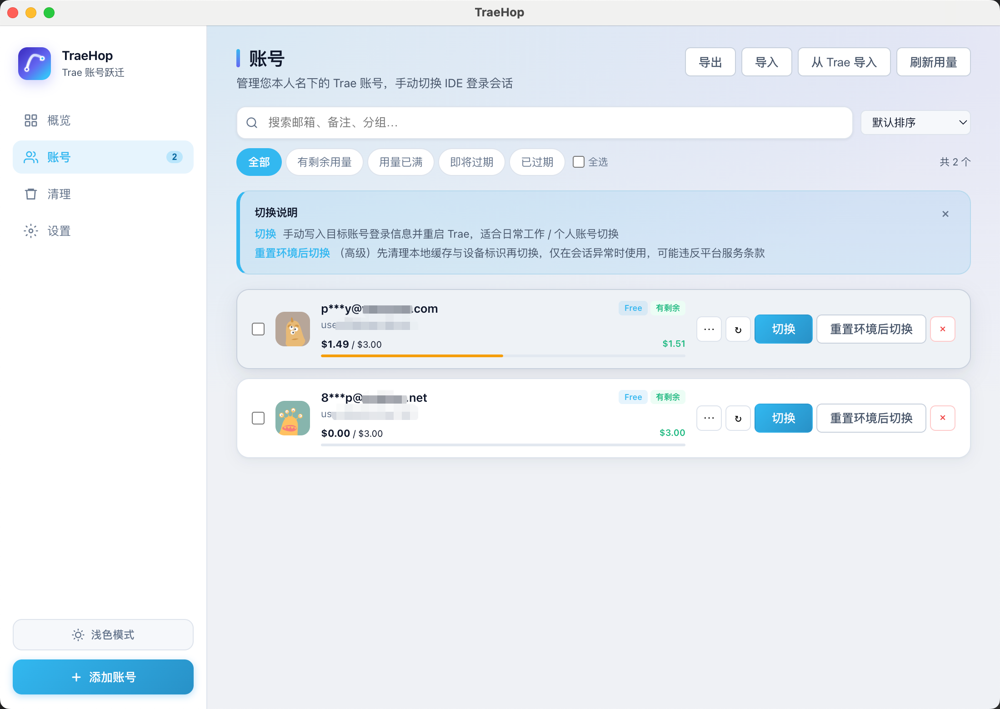

# TraeHop

**Trae IDE 本地多账号会话管理 — 开源、本地存储、手动切换**

TraeHop（Trae 账号跃迁）帮助持有多个合法 Trae 账号的开发者与团队，在 macOS / Windows 上手动切换 IDE 登录会话，省去反复登录。

[](https://github.com/kivenZhou/traehop/stargazers)
[](https://github.com/kivenZhou/traehop/releases)
[](LICENSE)

[](https://www.fastx.ink)

<p align="center">
  
</p>

**[📥 下载 Releases](https://github.com/kivenZhou/traehop/releases)** · **[⭐ Star 本项目](https://github.com/kivenZhou/traehop)** · **[🌐 官网](https://www.fastx.ink)**

---

## 这是什么

TraeHop 是一款 **Electron 桌面应用**，只做一件事：在你**本人名下、合规注册**的多个 Trae 账号之间，**手动**切换 IDE 会话。

| | TraeHop | 常见「换号工具」 |
|---|---------|----------------|
| 🔒 数据存储 | ✅ 100% 本地，无远程服务器 | ⚠️ 部分含云端或不可审计闭源 |
| 🔄 切换方式 | ✅ 仅手动，由你决定何时切换 | ⚠️ 部分支持额度耗尽自动轮换 |
| 📖 代码 | ✅ MIT 开源，可自行审查 | ❌ 多为闭源 |
| 🖥️ 平台 | ✅ macOS + Windows 双平台 | ⚠️ 多数仅 Windows |
| 🌐 登录方式 | ✅ 浏览器登录（2FA）、Token、IDE 导入 | ⚠️ 通常仅 Token |

> ⛔ **TraeHop 不是额度套利工具。** 不提供自动换号、不代理 API、不上传凭证。

---

## 功能一览

| | 模块 | 能力 |
|---|------|------|
| 👤 | **账号** | 浏览器登录 / 粘贴 Token / 从 Trae IDE 导入；分组、备注、搜索排序筛选 |
| 🔄 | **切换** | 一键写入会话并重启 Trae；系统托盘快捷切换 |
| 🔑 | **续期** | 浏览器续登、Cookie 刷新 Token、提前登录 |
| 📊 | **用量** | 可选的后台刷新与历史记录（默认关闭，仅供参考） |
| 💾 | **备份** | JSON 导出，支持 AES-256-GCM 密码加密；定时自动备份 |
| 🎨 | **界面** | 深色 / 浅色主题，中文 / English |
| ⚙️ | **高级** | 环境清理、设备标识管理 — 仅在会话异常时使用，见下文 |

---

## 使用须知

使用前请了解：

- ✅ 仅用于管理**您本人合法持有**的 Trae 账号
- 🔒 所有 Token、Cookie 保存在本机 [`~/Library/Application Support/traehop/`（macOS）或 `%APPDATA%\traehop\`（Windows）](#数据位置)，不上传远程
- ⚠️ 使用本工具**可能违反 Trae 用户协议**，封号等风险由您自行承担
- 🚫 不得用于批量注册、额度套利、代注册或绕过计费
- ⚡ 「重置环境后切换」和设备标识修改属于高级操作，可能触发平台风控

首次启动需阅读并同意应用内免责声明。

---

## 安装

### 📥 预构建安装包（推荐）

从 [GitHub Releases](https://github.com/kivenZhou/traehop/releases) 下载：

| 平台 | 文件 |
|------|------|
| 🍎 macOS Apple Silicon | `TraeHop-*-mac-arm64.dmg` |
| 🍎 macOS Intel | `TraeHop-*-mac-x64.dmg` |
| 🪟 Windows x64 | `TraeHop-*-win-x64.exe` |

请只从上述 Releases 或 [官网](https://www.fastx.ink) 下载，第三方重打包版本无法验证。

### 🔨 从源码运行

```bash
git clone https://github.com/kivenZhou/traehop.git
cd traehop
npm install
npm run icons   # 可选
npm start
```

### 📦 构建发布包（维护者）

```bash
npm run dist:mac-arm64   # macOS Apple Silicon
npm run dist:mac-x64     # macOS Intel
npm run dist:win         # Windows x64
npm run dist:all         # 以上三个依次构建 → release/
npm run publish:release  # 上传 GitHub Releases（需 gh CLI）
```

---

## 快速上手

```
🚀 启动 → 📋 同意须知 → ⚙️ 配置 Trae 路径 → ➕ 添加账号 → 🔄 点击「切换」
```

**添加账号** — 三选一：

| | 方式 | 说明 |
|---|------|------|
| 🌐 | **浏览器登录**（推荐） | 弹出窗口登录 trae.ai，支持 2FA，成功后自动添加 |
| 📋 | **粘贴 Token** | F12 → Network → 筛选 `GetUserToken` → 复制响应中的 Token |
| 📥 | **从 Trae 导入** | 在 IDE 中登录目标账号后，一键导入当前会话 |

**切换账号**：在账号页点击「切换」，Trae 会关闭并以目标账号重新打开。切换前请保存 IDE 内未保存的工作。

**切换模式**：

| | 按钮 | 说明 |
|---|------|------|
| 🔄 | **切换** | 日常使用：写入目标会话并重启 Trae |
| ⚡ | **重置环境后切换** | 高级：先清理本地缓存与设备标识再切换，仅会话损坏时使用 |

**备份与迁移**：💾 账号页导出 JSON（可设密码加密），换机或团队共享配置时用 📥 导入功能恢复。

---

## 数据位置

| | 内容 | 路径 |
|---|------|------|
| 📁 | TraeHop 配置与账号库 | macOS: `~/Library/Application Support/traehop/`<br>Windows: `%APPDATA%\traehop\` |
| 🔗 | Trae 会话文件 | 切换时写入 Trae 自身的 app support 目录 |
| 💾 | 手动 / 自动备份 | 用户在设置中指定的本地目录 |

凭证默认以明文存于本地 electron-store。建议启用 🔐 加密导出，并保持 OS 账户安全。

---

## 设置说明

| | 选项 | 默认 | 说明 |
|---|------|------|------|
| 📊 | 用量自动刷新 | 关 | 开启后每 5–60 分钟拉取各账号 API 用量 |
| 🔔 | 低用量通知 | 关 | 剩余低于阈值时系统通知 |
| ⏰ | Token 过期提醒 | 开 | 过期或即将过期时通知 |
| 💾 | 自动备份 | 关 | 定时导出明文 JSON 到指定目录 |

---

## 常见问题

| | 问题 | 解答 |
|---|------|------|
| 🔄 | 切换后 Trae 没有自动打开？ | 检查设置中的 Trae 路径是否正确；macOS 需确认已授予必要权限。 |
| 🔑 | Token 无效？ | 检查是否有多余空格、是否已过期。优先用 🌐 浏览器登录。 |
| 👤 | 切换后仍显示旧账号？ | 手动关闭 Trae，尝试 ⚡「重置环境后切换」，或在「清理」页执行环境清理后再切换。 |
| 🐧 | 支持 Linux 吗？ | 不支持。Trae IDE 官方仅支持 Windows 和 macOS。 |
| ❓ | 和其他工具有何不同？ | TraeHop 定位是合规的本地会话管理：开源可审计、纯本地、仅手动切换、双平台、支持浏览器登录与加密备份。详见上文对比表。 |

---

## 官方渠道

| | 渠道 | 链接 |
|---|------|------|
| 📦 | 应用与安装包 | [github.com/kivenZhou/traehop](https://github.com/kivenZhou/traehop) |
| 🌐 | 官网 | [www.fastx.ink](https://www.fastx.ink) |
| 💻 | 官网源码 | [github.com/kivenZhou/fastx](https://github.com/kivenZhou/fastx) |

---

## 开发

```
traehop/
├── electron/     # 主进程：切换、API、登录、清理、托盘
├── src/          # 渲染进程 UI（HTML / CSS / JS）
├── build/        # 图标与截图
└── scripts/      # 图标生成、发布脚本
```

技术栈：⚡ Electron 35 · 💾 electron-store · 🎨 Vanilla JS · 🌍 i18n（中 / 英）

```bash
npm run icons   # 修改 build/icon.svg 后重新生成图标
```

问题反馈：[Issues](https://github.com/kivenZhou/traehop/issues)

---

## License

[MIT](LICENSE) — 附加限制：不得用于规避 Trae 平台计费、额度限制或用户协议。

---

## English

**TraeHop** is a local, open-source session manager for developers who legitimately hold multiple Trae IDE accounts. Switch manually between work, personal, and client accounts on macOS and Windows — credentials stay on your machine, never uploaded.

- 🔄 Manual switch only — no auto-rotation on quota exhaustion
- 🌐 Browser login (2FA), token paste, or import from Trae IDE
- 🔐 Encrypted export (AES-256-GCM), groups, notes, optional usage monitor
- ⛔ Not a quota-arbitrage tool

Install from [Releases](https://github.com/kivenZhou/traehop/releases). See sections above for details.
